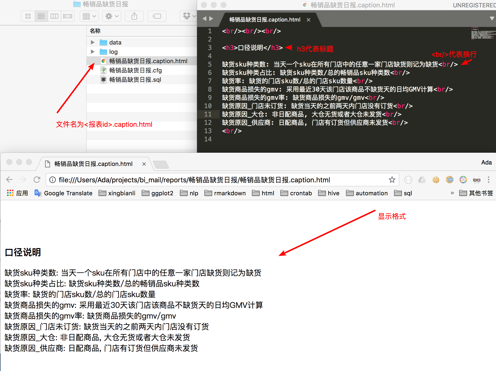

## 邮件报表系统配置

该项目为邮件报表配置，是[邮件报表](https://bitbucket.org/adalee2future/bi_mail)的子项目

### 邮件报表项目

<https://bitbucket.org/adalee2future/bi_mail>

#### 开发者

* 开发者: 李阿大
* 开发语言: python3
* 首次代码提交时间: 2017-10-01
* 第一版发布时间: 2017-10-31

#### 其他 

[报表规范](https://bitbucket.org/adalee2future/reports/src/master/standard.md)
[报表运维](https://bitbucket.org/adalee2future/reports/src/master/maintenance.md)

## 使用

### 配置方法

(请勿使用windows记事本来写配置文件，可以用notepad++, sublime, vim等) 

1\. 确定报表id，中文名英文名都行，不能有空格，如"货架公司运营情况"   
2\. 创建报表配置文件夹，名字为[报表id]，如"货架公司运营情况"  
3\. 创建配置文件[报表id].cfg，如：货架公司运营情况.cfg，内容参考如下  

```json
{
  "report_id": "货架公司运营情况",
   "report_name": "货架公司运营情况",
   "owner": "ada.li",
   "to": "bob.zhang@abc.com,ada.li@abc.com",
   "subject": "货架公司运营情况",
   "file_type": "xlsx",
   "frequency": "每周一 11:00",
   "db_type": "odps"
}
```
  * `report_id`, `report_name` 写一样
  * `owner`是报表所有人，请写你的邮箱前缀，`owner`可以是多个人，用逗号隔开，如'ada.li,xiaowei.li'
  * `to`为收件人，英文逗号分隔，如果需要抄送或者密送，可用`cc`和`bcc`，如"cc": "san.zhang"，还有所有邮件抄送满哥
  * `subject`为邮件主题，一般和report_id写一样，也可以不一样
  * `file_type` 为文件类型，可为"xlsx"或者"csv"或者"html"，当为"xlsx"或者"csv"时候，为附件；"html"时，数据内容在邮件正文显示，建议当返回条数小于50条时候，选择"html"
  * `frequency` 频率，我根据这个来配置调度时间，写法自由，程序不读这个
  * `db_type`为数据库类型,maxcompute请写"odps"，mysql写"mysql"

请保证你的json合法，如不确定，可以在[jsonlint](https://jsonlint.com/)上验证

4\. 创建sql文件：[报表id].sql，如：货架公司运营情况.sql

```sql
select
  city_name `城市`,
  area `区域`,
  corp_name `公司名称`,
  detail_address `公司地址`,
  contact_names `联系人`,
  telephones `联系方式`,
  machine_cnt `货架数`,
  earliest_online_date `铺货日期`,
  avg_30days_order_cnt_wday `近30天平均订单数（工作日）`,  
  avg_30days_order_cnt_wend `近30天平均订单数（周末）`,  
  avg_30days_origin_amount_wday `近30天平均销售额（工作日）`,
  avg_30days_origin_amount_wend `近30天平均销售额（周末）`,
  avg_30days_actual_amount_wday `近30天平均实付额（工作日）`,
  avg_30days_actual_amount_wend `近30天平均实付额（周末）`,
  avg_7days_order_cnt_wday `近7天平均订单数（工作日）`,  
  avg_7days_order_cnt_wend `近7天平均订单数（周末）`,  
  avg_7days_origin_amount_wday `近7天平均销售额（工作日）`,
  avg_7days_origin_amount_wend `近7天平均销售额（周末）`,
  avg_7days_actual_amount_wday `近7天平均实付额（工作日）`,
  avg_7days_actual_amount_wend `近7天平均实付额（周末）`
from kylin.ada_rack_customer_recent_sale_conditions
where pt = '{pt}'
;
```

  * 其中`{pt}`是变量，当db_type为odps时默认为昨天日期字符串'%Y%m%d'，如'20180405'，当db_type为mysql时默认为今天日期字符串，如'20180406'
  * 还有`{dt}`变量，当db_type为odps时默认为昨天日期字符串'%Y-%m-%d'，如'2018-04-05'，当db_type为mysql时默认为今天日期字符串，如'2018-04-06'
  * 对于odps sql语句，如果跨越多个分区，会有一万条限制，如果只有一个分区或者没有分区，则没有条数限制
  * 当cfg文件配置`file_type`为xlsx和html时，则支持多个sql查询语句，每个语句一个sheet, 语句之间用分号隔开
  * 对于多个查询结果，如果要给每个查询结果一个副标题，可以用 `df_names`，如 "df_names": ["副标题1", "副标题2"]，对于excel，即为每个sheet名字，对于html，即为每块的副标题
  * odps每个表都要写项目名; mysql每个表都要写库名，mysql请勿有任何注释

每次sql变更请都在数据库跑过，确认正确再提交

### 上线代码

1\. 需要git账号，没有git账号，请找IT
2\. 让报表管理员将你的git账号加入自动发邮件配置项目`reports`
3\. 进入`reports`项目  

* 添加文件`货架公司运营情况/货架公司运营情况.cfg`，提交信息写清楚，如"添加货架公司运营情况配置文件",点击提交
* 在`货架公司运营情况/`文件夹 下添加`货架公司运营情况.sql`，提交信息写清楚，如"添加货架公司运营情况sql文件"，点击提交

<span style="font-size: xx-small">注: 一开始没有报表文件夹，所以第一次建文件的时候带上文件夹名字，会自动把文件夹也建上 </span>

4\. 通知管理员，将修改合并到master分支，设定邮件定时发送时间  

### 修改代码

提交信息写清楚改了什么，然后让管理员合并代码到master分支。每隔1分钟，代码会自动部署到服务器  

注：代码自动部署时间为每天00:00-23:50，23:50-24:00提交的代码会等到第二天才部署

### 报表运行错误

如果有错误，会给报表负责人发一封邮件，包含运行日志，这样可以排查问题

### 手动发报表

邮件报表负责人可以通过发一封邮件手动跑报表  

用法：发邮件给data-report@abc.com，邮件主题为: bi_mail run 报表id    
如 `bi_mail run wms仓库日报`    
则一分钟内，系统就会自动发`wms仓库日报`报表   

如果需要收件人和cfg中配置的不一样，比如只发给自己或者几个人先看看，则邮件主题为: bi_mail run 报表id 收件人，如`bi_mail run 门店欠货明细 to=si.li@abc.com,amy.zhao@abc.com` 

也可以指定{pt}变量，和指定收件人之间用分号隔开，不能有空格，以下均合法

```
bi_mail run 营销日报
bi_mail run 营销日报 to=bob.li@abc.com,ada.li@abc.com
bi_mail run 营销日报 pt=20180301
bi_mail run 营销日报 pt=20180301;to=bob.li@abc.com,ada.li@abc.com
bi_mail run 营销日报 to=bob.li@abc.com;pt=20180301
```

注:

* 空格只能有一个，否则会解析错误
* 所有手动发的报表均会抄送管理员
* 手动发报表为每天00:00-23:50，23:50-24:00发送的邮件，会第二天才处理
* 如果代码中用到`dt`变量，也会变为和pt对应的日期字符串，如pt=20180301，则dt会变为'2018-03-01'

### 下线代码

1\. 配置文件添加 "is_online": false  
2\. 通知管理员，删除crontab定时   

## 附

### 其他配置

#### 多种文件类型组合

如果正文和excel都想要，比如正文只包含汇总数据，excel包含汇总和明细数据  
则配置如下  

1\. 设置df_names，给每个模块命名，如

```
"df_names" : ["门店咖啡销量汇总", "门店咖啡销售明细", "外卖咖啡销量汇总", "外卖销售明细"]
```

2\. 设置file_type，每种类型文件包含哪些模块 (html为邮件正文)，如

```
"file_type": {"html": ["门店咖啡销量汇总", "外卖咖啡销量汇总"], "xlsx": ["门店咖啡销量汇总", "门店咖啡销售明细", "外卖咖啡销量汇总", "外卖销售明细"]}
```


#### 依赖关系 (`dependency`)

支持odps依赖关系

* 对于分区表，分区名不限，会自动读取表的分区名，分区值必须是日期字符串为'yyyymmdd'格式，用法如下，会等待昨日分区数据准备好
* 对于非分区表，会等待到该表的最后更新时间为今天
 
```json
"dependency": 
  {
    "kylin": ["table_1", "table_2"],
    "phoenix": ["table_x"]
  }
```
注：依赖最多等待6个小时，6小时等不到，报错退出

#### 合并单元格 (`merge`)

* `merge`表示是否合并单元格，默认不合并，可选值:`true`和`false`，如"merge": true  
* 支持文件类型："xlsx"和"html"

#### 冻结行列(`freeze_panes_list`)

* 对于excel，可以选择前几行和前几列冻结，如"freeze_panes_list": [[1 ,0], [1, 3]]表示第一个sheet冻结第一行，第二个sheet冻结第一行和前3列

默认冻结第一行（标题）


#### 空数据强制报错或者不发出来 (`no_data_handler`)

格式如 "no\_data\_handler": {"condition": "any", "action": "error"}

 * 其中condition 可以是"all"或者"any", "action" 可以是"error"或者"exit"
 * condition表示当多少个sql结果为空时，采取行动，all即所有数据为空，any即任一数据为空
 * action表示行动，"error" 即邮件强制报错，数据不发出去，"exit"表示强制退出，不报错，数据也不发出去
 * 不配置的时候
    * mysql默认为`null`(无数据情况不处理，照常发给用户)
    * odps默认为`{"condition": "any", "action": "error"}` (任意数据为空，则报错退出)

#### 假抄送 (`fake_cc`)

格式如 "fake_cc": "sam.lu@abc.com"   

在邮件可以看到抄送该人，但实际上并没有发给他

#### 行权限设置 (`row_permission`)

一个报表可以发多封邮件，相同权限的人同一封邮件

例子参考报表`一报多发测试`，文档后续补上

#### excel附件太大的时候只提供下载链接功能

出于数据安全的考虑，该功能只能管理员设置

设置方法：

登录服务器，修改~/.profile文件中的环境变量`oss_link_reports`，如以下三个报表提供附件下载功能

```
export oss_link_reports="测试,cm城市数据,货架财务对账"
```

#### excel格式(`xlsx_formats_list`)

* 设置列格式子健为`col_formats`
* 设置列格式子健为`conditional_formats`

```
  "xlsx_formats_list": [{}, {}]
  
```

每个sheet一个花括号，如果该sheet没有配置，直接 {}，如果有配置，则如下

需要设置列格式，则用子健`col_formats`，需要设置条件格式，则用子健`conditional_formats`，如

```
{
	"col_formats": [{
			"col_names": ["营业额完成率", "利润额完成率"],
			"format": {
				"num_format": "0.0%"
			}
		},
		{
			"col_names": ["目标营业额", "本月营业额"],
			"format": {
				"num_format": "#,##0"
			}
		}
	],

	"conditional_formats": [{
			"col_names": ["营业额完成率", "利润额完成率"],
			"options": {
				"type": "top",
				"value": 1
			},
			"format": {
				"font_color": "green"
			}
		},
		{
			"col_names": ["营业额完成率", "利润额完成率"],
			"options": {
				"type": "bottom",
				"value": 1
			},
			"format": {
				"font_color": "red"
			}
		}
	]
}
```

表示 

列格式：营业额完成率、利润额完成率使用百分号显示，保留一位小数；目标营业额、本月营业额千分位符，保留到个位数

条件格式：营业额完成率、利润额完成率最大的值绿色高亮，最小值红色高亮

其他的配置

* 格式参考<https://xlsxwriter.readthedocs.io/format.html>
* 条件格式参考<https://xlsxwriter.readthedocs.io/working_with_conditional_formats.html>


数据类型，显示精度，百分比，字体，文字大小等，文档后续补上  
暂时可以先参考<智能设备监控日报>

条件高亮，如top 10, top 10%, 超过某个值，平均值，标准差若干倍高亮，高亮格式可以任意配置，如字体颜色设置为红色。文档后续补上  
暂时可以先参考<智能设备监控日报>

#### html格式(`html_formats_list`)

* 设置列格式子健为`col_formats`
* 设置条件格式子健为`conditional_formats`

文档后续补上，可以先参考`畅销品缺货日报`

#### 超链接(`hyperlinks`)

需要两个字段，一个字段为显示，另一个字段为链接

配置如 

```
"hyperlinks": [
  {
    "text_field": "采购单号",
    "url_field": "采购单号链接",
    "merged_field": "采购单号"
  }
]
```

则会把`采购单号`和`采购单号链接`这两个字段合并成链接，
前者为链接的显示，后者为链接的地址，`merged_field`表示 
合并后的字段名字，可以不设置，默认为和`text_field`一样  
如果有多组字段合并，则用逗号分隔，如`"hyperlinks": [{...}, {...}]`，每组合并都会把原来的字段删除

#### 添加报表说明

支持报表说明，如指标释义等等，只需要加一个文件，放在报表文件夹下，命名为<报表id>.caption.html

则该内容就会在邮件正文显示，语法为html

比如 


